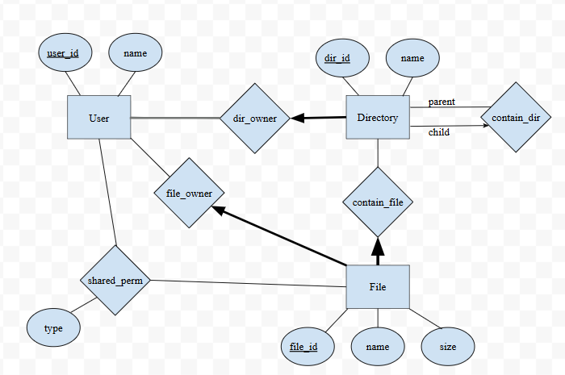

# Homework 1 File system schema submission

## Schema design



We used a relation block for the user ownership of both directories and files in the ER diagram. However, what we want to do is include the user_id as a foreign key inside the directory table so those two ownership relations are not actual tables on their own. But I don't think we can directly draw a connection between the two entities and thus the relation block is used. 

The same applies to the contain_file relation between the directory and file. Since each file can only be under one directory normally, we are also adding the dir_id as a foreign key in the file table. 

## Create Table Statements 

```
CREATE TABLE User(
    user_id CHAR(20),
    username CHAR(30),
    PRIMARY KEY (user_id),
)

CREATE TABLE Directory(
    dir_id CHAR(20),
    dir_name CHAR(30),
    user_id CHAR(20) NOT NULL,
    PRIMARY KEY (dir_id),
    FOREIGN KEY (user_id) REFERENCES User, 
)

CREATE TABLE File(
    file_id CHAR(20),
    file_name CHAR(30),
    file_size INT,
    user_id CHAR(20) NOT NULL,
    dir_id CHAR(20) NOT NULL,
    PRIMARY KEY (file_id),
    FOREIGN KEY (user_id) REFERENCES User,
    FOREIGN KEY (dir_id) REFERENCES Directory,
)

CREATE TABLE contain_dir(
    child_dir_id CHAR(20),
    parent_dir_id CHAR(20),
    PRIMARY KEY (child_dir_id),
    FOREIGN KEY (child_dir_id) REFERENCES Directory(dir_id),
    FOREIGN KEY (parent_dir_id) REFERENCES Directory(dir_id),
)

CREATE TABLE shared_perm(
    user_id CHAR(20),
    file_id CHAR(20),
    perm_type CHAR(3),
    PRIMARY KEY (user_id, file_id),
    FOREIGN KEY (user_id) REFERENCES User,
    FOREIGN KEY (file_id)
)
```
